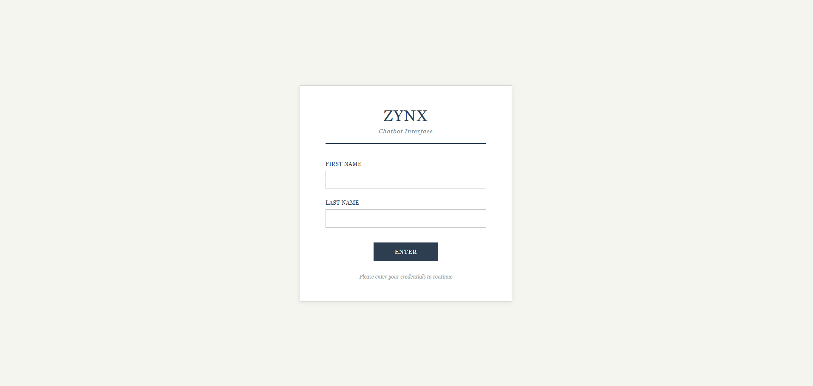
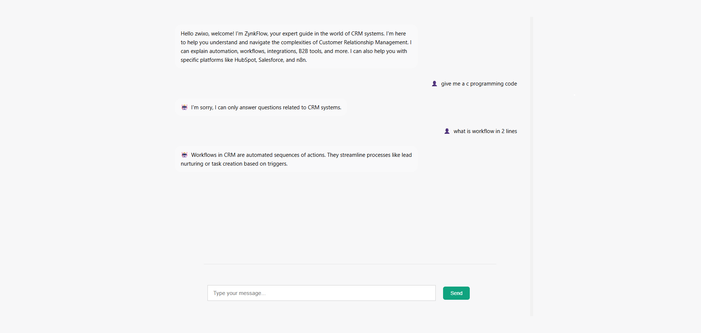

# 💼 Personal Project by **Zwixo**

## 🤖 ChatBot (in progress)

This is a **personal project** built by **Zwixo**, focused on creating an intelligent chatbot using **Node.js** and **Express**.

The chatbot is specialized in **CRM** systems.

It uses the **Google Generative AI API** to answer questions only related to:
- CRM automation  
- Workflows  
- Integrations
- Other CRM-related concepts  

If a question is not related to CRM, the bot politely says it can only answer CRM-related topics.

---

##  Features (so far)
- Trained to answer only CRM questions  
- Strong, educational responses  
- Memory for ongoing conversation  
- Uses **EJS** for front-end rendering  

---

## Status
This project is still **under development**.  
More details and setup instructions will be added soon.

---

## Preview



---

## 📅 Coming soon
- Add training data improvement  
- Add a chat UI with message history  
- Improve error handling and bot responses  

---

> 🗂️ **Note:**  
> This README is shared for preview purposes only.  
> The full project files will be published once development is complete.

## 🚀 Installation

To install the required dependencies, run the following command:

```bash
-> npm i

-> nodmon index.js